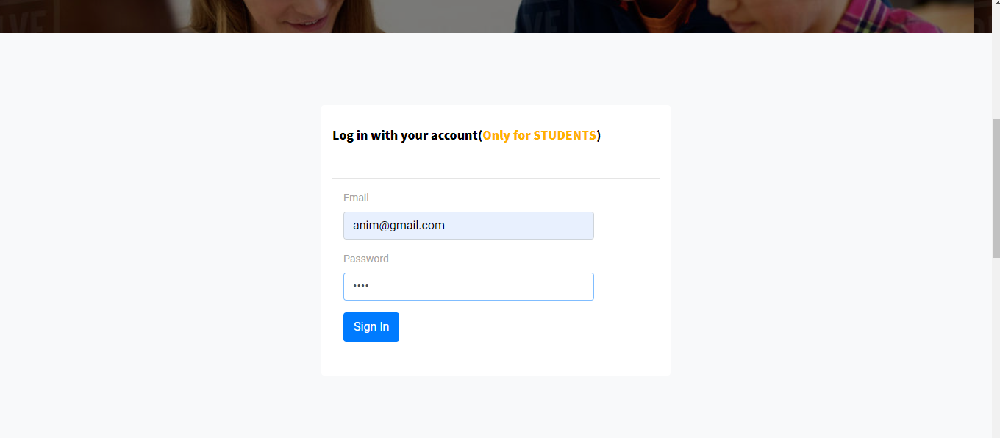
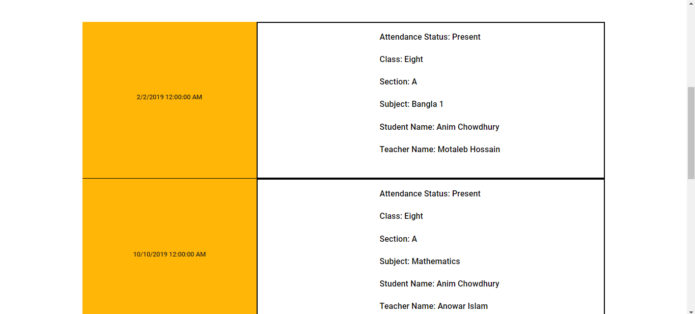
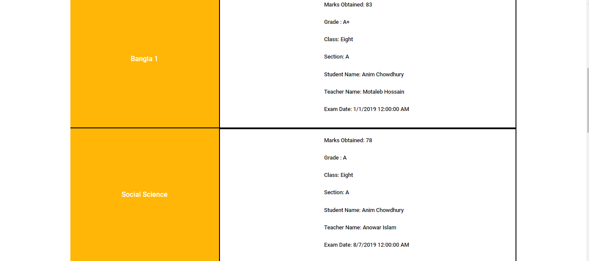
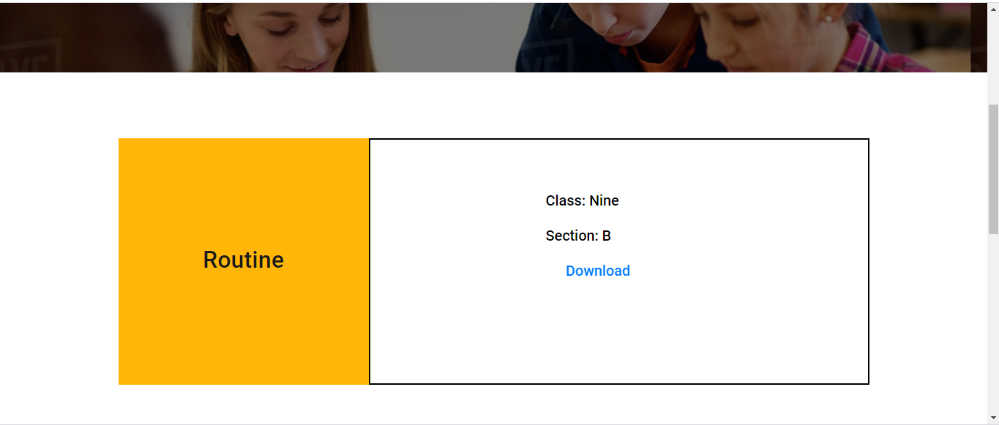
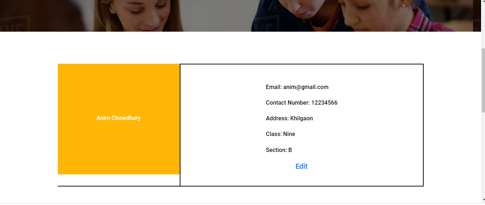
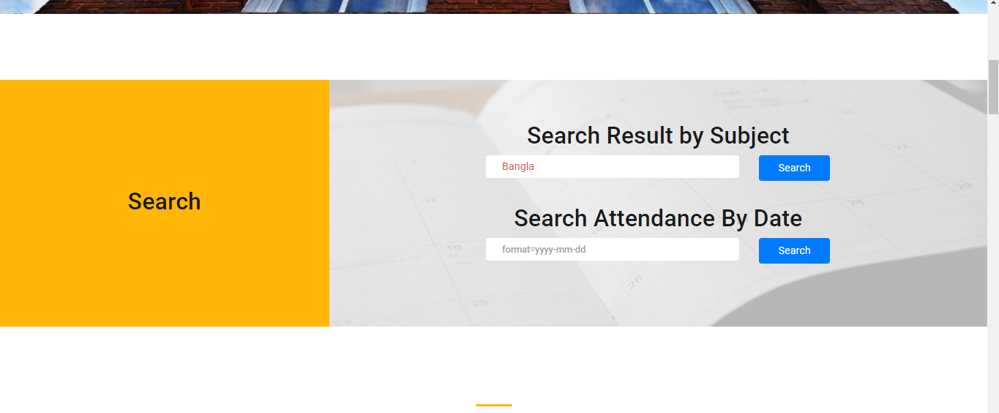
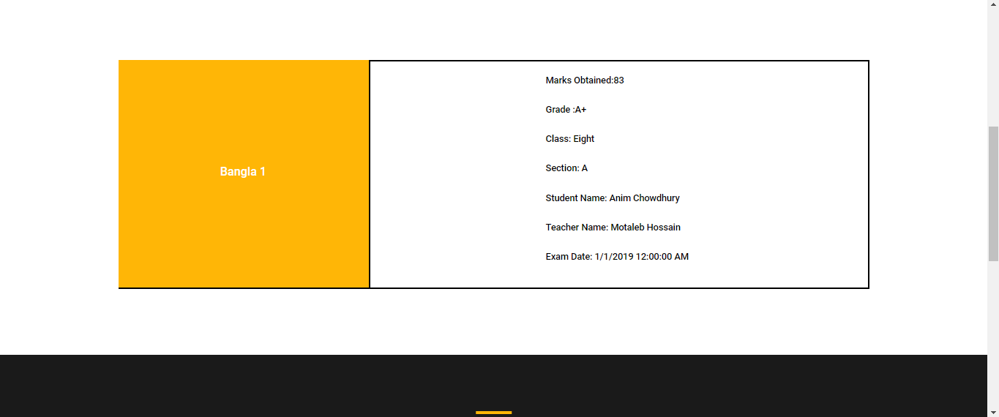
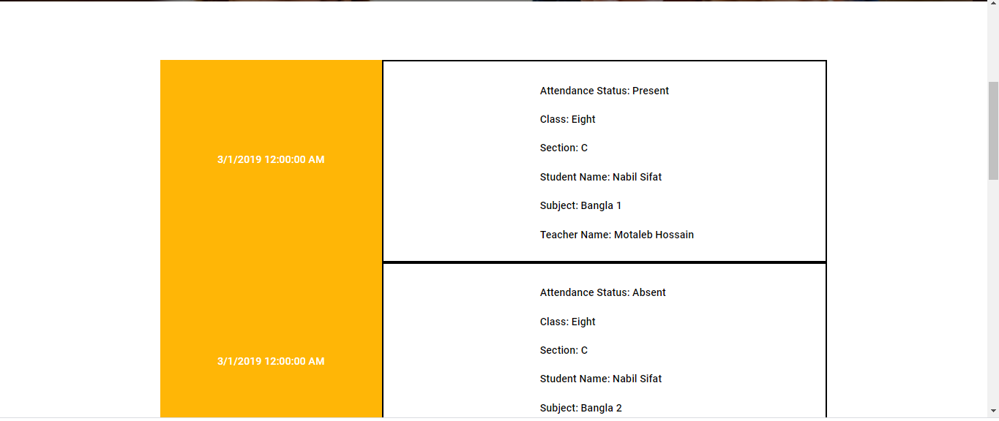
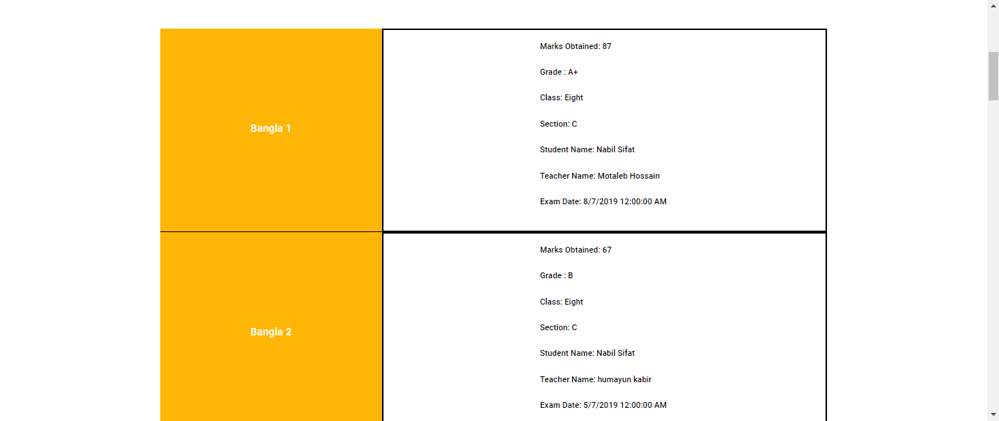
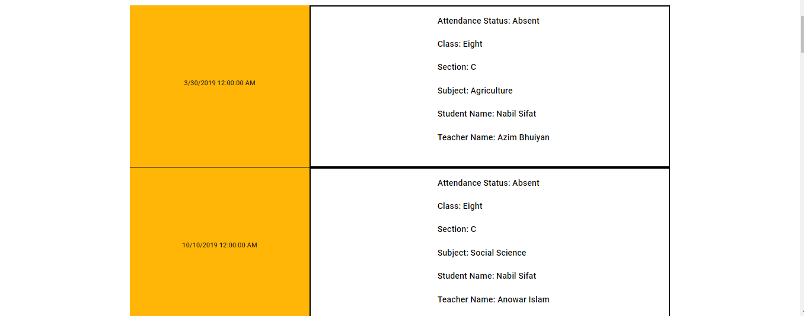

This school website has four users:

1.Teacher:
  a)download his schedule/routine
  b)search attendance by date(taken by him)
  c)search result by subject
  d)view all the attendances taken by him
  
2.Student:
  a)download his class routine
  b)search his attendance by date
  c)view all his attendance
  d)view his result
  
3.Guardian:
  a)download his/her children class routine
  b)view his/her children attendance, result
  c)give review about school
  
4.Admin:
  a)create account for teachers, students and guardians
  b)add teachers and students routine
  c)add results, attendance records
  d)add news/events
  

 
 
  <h3> Home Page  </h3>

 

 

  <h3>Logging in as a student </h3>
  
 
 
 

 

  <h3> Features available to the students  </h3>
  
 
 
 

  <h3> Attendance record of a student  </h3>
  
 
 
 

  <h3> Exam Result of a student  </h3>
  
 
 
 

  <h3>   </h3>
  
 
 
 

  <h3>   </h3>
  
 
 
 

  <h3>   </h3>
  
 
 
 

  <h3>   </h3>
  
 
 
 

  <h3>   </h3>
  
 
 
 

  <h3>   </h3>
  
 
 
 

  <h3>   </h3>
  
 
 
 

  <h3>   </h3>
  
 
 
 

